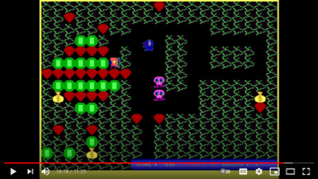

  
Digger
======

The classic Digger game recreated in GW BASIC using ASCII characters. I had created it in around 2000-2001. It was a time when I didn't have internet access and only had a 20MHz PC which couldn't run Windows.

Digger.bas is the first version of Digger I created. A bit crude, the monsters used to get stuck very easily and the exterminator monster would come up very quickly. There were also a bunch of bugs that were left un-fixed. This program works best in GW-BASIC.

A-Digger.bas is Advanced Digger, where I came up with a better idea for monsters to follow the digger and the possibility of the exterminator switching to a normal monster on detecting the digger trail. This I programmed when I had just completed high-school. This program was originally programmed in GW-BASIC, but later ported to Q-BASIC.

Digger-forever.bas: I programmed this in October 2003, on a room-mate's PC I borrowed in my engineering college hostel. I had learnt BASIC graphics by then, and programmed this for a state level hobby project competition conducted by the ISTE student chapter. I presented all my games in the competition and won the first prize, securing Rs.2000 as a cash award. Room-mate and friends of course, got a generous treat :-). You'll need Q-BASIC to run this game. It was programmed on a Pentium III or a Pentium IV machine, so you'd need a reasonably fast computer to run this game. The help menu will show you some keys you can use to adjust game speed.

Digger, was one of the primary motivations for me to get into game programming. My cousins had let me play digger on their computer in around 1994 or 1995 (during those times computers were only available with privileged people) and we got to play Digger during our computer classes also at about that time (the teacher used to allow us to play games because they hadn't yet begun teaching us Logo). I wanted to play the game at home too. By the time I got a computer at home, they didn't have the game with them anymore (those used to be on the 5.25 inch floppy drives). So I decided to create Digger myself!

I recently found out that a person who had similarly created his own version of Digger, decided to review my programs. 
The video is here: 

And this was his Digger: https://www.youtube.com/watch?v=ch9ezxnidbY
